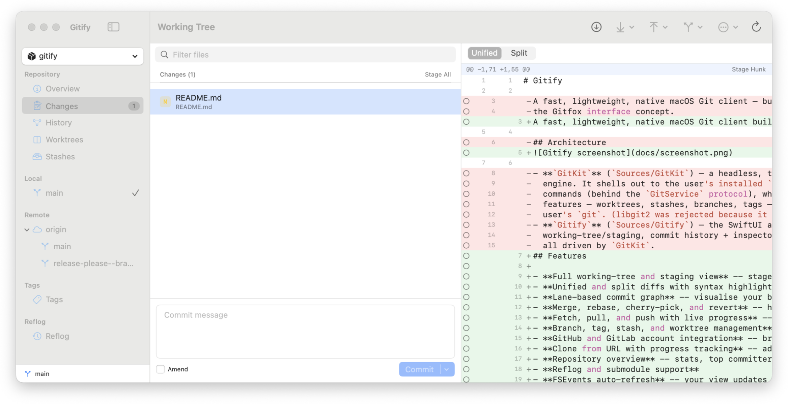

# Gitify

A fast, lightweight, native macOS Git client built entirely with SwiftUI and AppKit. No Electron, no embedded runtimes - just a clean, responsive app that wraps your installed `git` binary so every operation matches your exact git config.



## Features

- **Full working-tree and staging view** - stage, unstage, and discard changes at the file, hunk, or individual line level
- **Unified and split diffs with syntax highlighting** - review changes the way you prefer
- **Lane-based commit graph** - visualise your branch history with a clean, interactive graph
- **Merge, rebase, cherry-pick, and revert** - handle complex workflows with guided dialogs and a 3-way conflict editor
- **Fetch, pull, and push with live progress** - see exactly what's happening during network operations
- **Branch, tag, stash, and worktree management** - all from a single sidebar
- **GitHub and GitLab account integration** - browse remote repositories and clone with a click
- **Clone from URL with progress tracking** - add repositories quickly
- **Repository overview** - stats, top committers, lines by language, and a rendered README
- **Reflog and submodule support**
- **FSEvents auto-refresh** - your view updates automatically when files change on disk
- **Check for Updates** - stay current via the built-in update checker

## Requirements

- macOS 14 or later

## Installation

1. Go to the [Releases](https://github.com/craigharman/gitify/releases) page
2. Download the latest `.dmg` file
3. Open the `.dmg` and drag **Gitify.app** into your Applications folder
4. On first launch, macOS will block the app because it is not signed with an Apple Developer ID. To allow it:
   - Open **System Settings** > **Privacy & Security**
   - Scroll down to the **Security** section
   - You will see a message that "Gitify" was blocked - click **Open Anyway**
   - Confirm in the dialog that appears

## Building from source

Gitify builds with the Swift CLI toolchain only - full Xcode is not required, just the Command Line Tools.

```sh
# Build
swift build

# Run the test suite
swift run GitKitChecks

# Assemble a runnable .app bundle
scripts/build-app.sh debug      # or: release
open build/Gitify.app
```

## License

See [LICENSE](LICENSE) for details.
